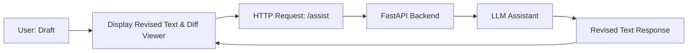

# Seminar Report LLM Assistant

## Overview

In this project, you will create an LLM-based writing assistant. The assistant uses a local large language model (via Ollama) to suggest improvements to a report. You will build a backend using FastAPI and a creative frontend using Streamlit. Students are encouraged to explore interface ideas, such as a diff viewer showing differences between the original text and the assistant’s suggestions, buttons for applying grammar-only corrections, and sliders for adjusting the influence between the original text and the new suggestions. Other creative features for the writing assistant are desired.
Also, we host an LLM on the HCI Numbercruncher, which can be accessed later. When working locally, we suggest using small models (<8b).

**Technology Stack:**
- **Backend:** FastAPI
- **Frontend:** Streamlit
- **Local LLM:** Ollama

## Task Description

### Objective

Develop a writing assistant that helps users improve their drafts. The assistant should (at minimum):
- Accept an original draft from the user.
- Provide an improved version based on one of two (or more) modes:
  - **Full Revision:** A comprehensive edit that improves clarity and style.
  - **Grammar Correction:** A mode focused solely on correcting grammar errors.
- Allow users to adjust the influence between the original text and the generated suggestions using a slider.
- Display the differences between the original text and the assistant’s output in a clear, user-friendly manner (e.g., using a diff viewer).

### Requirements

1. **Backend Implementation (FastAPI):**
   - Create a `/assist` endpoint that accepts a JSON payload containing:
     - The original text.
     - A correction mode (either `"full"` or `"grammar"`).
     - A weight value (a float between 0.0 and 1.0) that determines the emphasis on the new text.
   - The endpoint should return the assistant’s revised text based on the provided parameters.
   - For demonstration purposes, you can use a dummy function to simulate the LLM’s response.

2. **Frontend Implementation (Streamlit):**
   - Build an interface that lets users input their draft.
   - Include UI controls such as:
     - A text area for entering the original report.
     - A radio button group or toggle for selecting the correction mode.
     - A slider to adjust the weighting between the original text and the revised output.
   - When the user clicks a button (e.g., "Get Assistance"), the interface sends a request to the FastAPI backend and displays the assistant’s revised text.
   - Additionally, display a diff view that highlights the differences between the original and revised texts.

3. **Creativity and Interface Design:**
   - Get creative with your interface design. Consider including features such as:
     - A side-by-side comparison view.
     - Clear visual cues (e.g., color-coding) for changes.
     - Any other interactive elements that improve the user experience for writing and revising a seminar report.
     - And any other ideas you want to try.

## Architecture Diagram



## How to Run

### Virtual Environment and Dependencies Setup

1. **Create a Virtual Environment:**
   - In your project folder, run:
     ```bash
     python -m venv .pyenv
     ```
2. **Activate the Virtual Environment:**
   - On Windows:
     ```bash
     .pyenv\Scripts\activate
     ```
   - On Unix or MacOS:
     ```bash
     source .pyenv/bin/activate
     ```
3. **Install Dependencies:**
   - Install the required packages using:
     ```bash
     pip install -r requirements.txt
     ```

### Start the Backend

In a terminal, run:
```bash
python backend.py
```
This will start the FastAPI backend on http://127.0.0.1:8000.

### Start the Frontend

In a separate terminal, run:
```bash
streamlit run frontend.py
```
This will launch the Streamlit frontend.

## Demo Video Instructions
Please record a demonstration video (2-3 minutes) that clearly shows:

- Starting the Backend:
    - How to run the FastAPI backend (e.g., executing python main.py).
- Launching the Frontend:
    - How to run the Streamlit application (e.g., executing streamlit run app.py).
- Using the Writing Assistant:
    - Inputting a draft, selecting a correction mode, adjusting the weight slider, and viewing the revised text along with the diff view.
- Discussion of Interface Features:
    - Explain any creative or innovative interface elements you implemented.

## Submission Checklist
All source code files:
- backend.py (FastAPI backend)
- frontend.py (Streamlit frontend)
- Any additional resources or configuration files
- A demonstration video in a common format (e.g., MP4)
- A README file with instructions on how to run your project